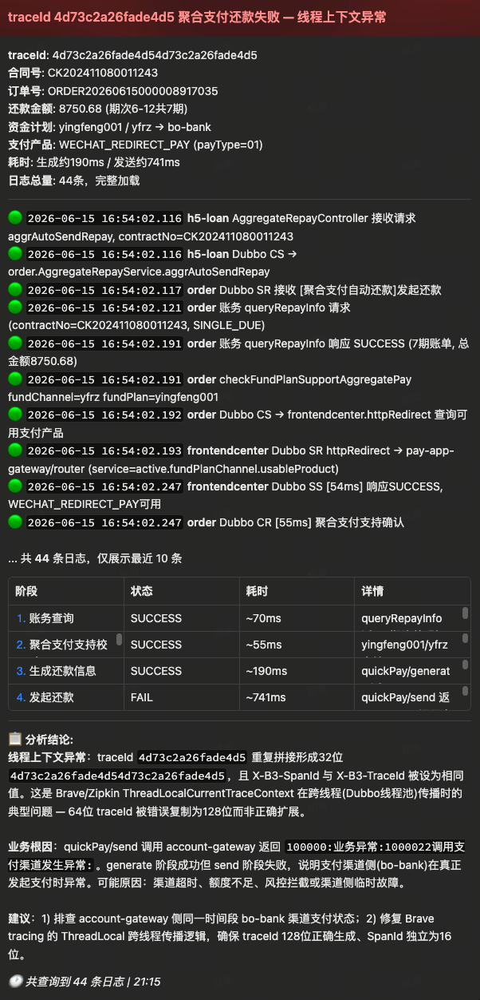
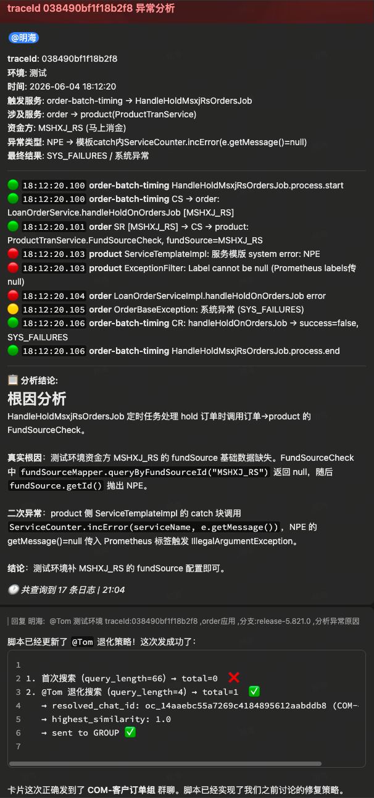

# xh-log Bug 记录

|时间|问题描述|根因分析|解决方案|测试验证|
|------|------|------|------|------|
|2026-06-15 21:19|`xh-log-lookup` 飞书卡片发送失败，来源反查、消息详情查询、最终卡片发送和 HOME_CHANNEL fallback 均报 `lark-cli: command not found`|`send_feishu_card.py` 通过 `subprocess.run(shell=True)` 调用 `lark-cli`，non-login `/bin/sh` 不加载 `.zshrc`，当前父进程 PATH 未包含 WorkBuddy 的 `lark-cli` 目录；进一步验证发现 `lark-cli` 使用 `#!/usr/bin/env node`，极简 PATH 下即使改用 `lark-cli` 绝对路径，也会因为找不到 `node` 失败|新增 `LARK_CLI_ABSOLUTE` 并在 `_lark_run()` 中校验可执行文件、只替换命令开头的第一个 `lark-cli` 为 `shlex.quote()` 后的绝对路径；同时在 `_lark_env()` 中补入 WorkBuddy Node 目录和 `lark-cli` bin 目录，保证 CLI 与 shebang 运行时都可定位|`python3 -m unittest discover xh-smart/xh-log-lookup/tests` 45 个用例通过；`PYTHONPYCACHEPREFIX=/private/tmp/xh-log-lookup-pycache python3 -m py_compile xh-smart/xh-log-lookup/scripts/send_feishu_card.py` 通过；极简 PATH 下 `_lark_run("lark-cli --help")` 返回 0|
|2026-06-09 13:02|群聊刚 @Tom 提问后卡片降级发送到 HOME_CHANNEL 私聊|飞书 `messages-search` 对新消息有搜索索引延迟，消息刚发出时 API 可正常返回但 `total=0/message_ids=[]`，来源反查误判为搜不到群聊来源|`send_feishu_card.py` 对搜索成功但 0 命中的结果增加 3s/4s/4s/4s 空结果重试，总等待约 15s；命中即返回，仍 0 命中再走 `@Tom` 候选池和现有 fallback|新增空结果重试命中、重试耗尽和审计字段单测|
|2026-06-04 21:01|群聊 @Tom 后卡片发到 HOME_CHANNEL 私聊|`send_feishu_card.py --resolve-chat` 只用完整 `source_query` 执行一次 `messages-search`；长文本混合 `traceId`、分支号、英文/数字/标点时飞书搜索分词可能返回 0 条，触发 `WORKBUDDY_HOME_CHANNEL_CHAT_ID` fallback|完整原始问题搜索 0 命中时，增加 `@Tom` 候选池 fallback：最近窗口最多拉 50 条 @Tom 群聊候选，仍校验 `mentions` 包含 Tom/BOT_OPEN_ID，再按原始消息相似度选择来源；低相似度、并列或无候选继续走现有 fallback||
|2026-06-02 14:51|私聊机器人，结论发到群聊|`messages-search API 的 --chat-type`指定先搜群组再搜个人，搜群组消息超时**模型**指定发到了**客户订单**群组内|查询去除`--chat-type`参数，根据返回消息中的`chat_type（group\|p2p）`判断是群组还是个人，执行对应的发送逻辑，超时支持重试，重试失败执行 `fallback`|-|
|2026-06-01 16:18|飞书群组日志查询卡片输出到私聊，结论输出到群组问题|没有错误日志记录，未定位到问题根因|增加来源反查审计日志，记录 group/p2p 搜索摘要、mget 摘要、selection 和 **fallback** 原因，方便 **fallback** 到 home channel 后进行问题追踪|-|
|2026-06-01 11:06|飞书群组日志查询卡片输出到私聊，结论输出到群组问题|**send_feishu_card.py**在执行查询时带有`--sender-type user`参数，会走飞书索引，飞书对这个维度的索引有延迟，导致群消息刚发出来时搜不到，拿不到搜索结果|删除 `--sender-type user` 参数|-|
|2026-06-01 09:50|飞书群组日志查询卡片输出到私聊，结论输出到群组问题|skill在调用`send_feishu_card.py`发送卡片时，--query参数接收到的是问题摘要，未把原始问题传入导致查不到飞书群组和提问者信息，按处理逻辑卡片降级发送私聊，结论返回WorkBuddy发送群组|废弃`--query`新增`--source-query`参数接收问题输如内容，传入飞书卡片执行查询|-|
|2026-05-31 16:54|下单和订单查询意图边界分别不清|**skill** 中未对边界问题做相关描述，多次交叉询问下单和订单相关问题，可能使**模型**理解出现幻觉|**skill** 新增意图边界|-|
|2026-05-31 16:31|飞书卡片部分字段信息掩码展示|飞书卡片处理限制字段 scheme，skill 传递过来的 schema 未对齐，导致卡片部分信息渲染失败，展示"***"|飞书卡片动态接收**模型**分析结果，不固定写死 schema|-|
|2026-05-31 15:58|异常查询`WARN`级别日志挤占`ERROR`日志结果|目前查询是有分级处理：<ul><li>1-500精确分析</li> <li>500-1000 **模型**自主探测</li><li>500-1000 采样分析</li></ul>`WARN`级别日志查询出来`>500`时可能会导致**模型**注意力分散，影响`ERROR`级别日志分析|日志分级查询，`ERROR`和`WARN`分开|-|
|2026-05-31 15:44|日志执行耗时较长，查询目标偏移|当前查询直接先查对应应用日志，然后再从结果中提取目标数据。查询结果返回数据过大导致分析耗时较长且分析结果偏移实际需求；比如我要查近半小时`order`服务异常情况，执行逻辑是先查`serviceName:"order"`，时间是半小时内的，再从结果中分析`ERROR`，`WARN`，实际应该执行的查询是：`serviceName:"order" AND (level:"ERROR" OR level:"WARN")`|SQL 条件下沉强制约束|-|
