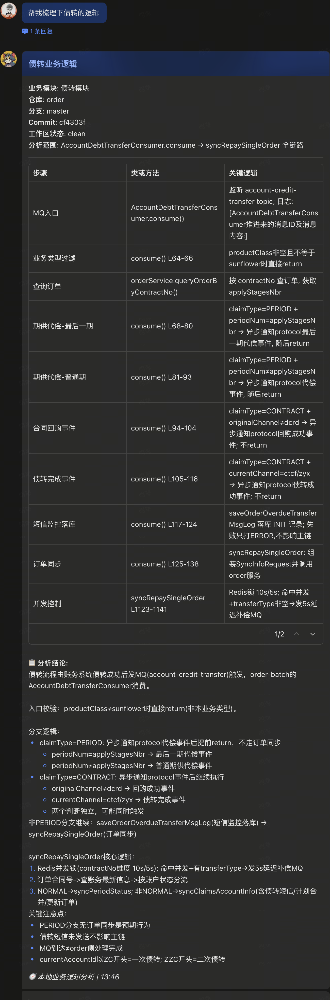
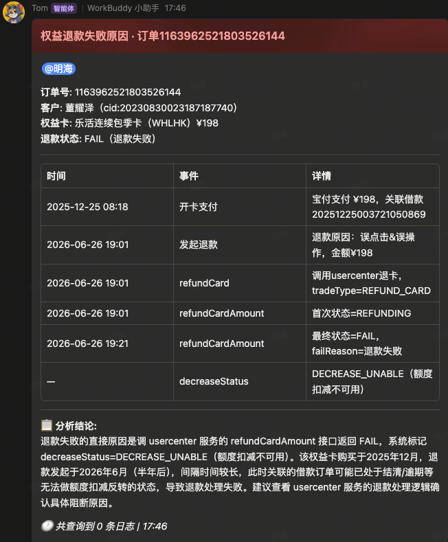

# xh-log 开发与 Bug 记录

|时间|需求背景 / Bug 问题与根因|需求描述 / Bug 解决方案|验证|
|------|------|------|------|
|2026-08-04 17:04|原 `loan.md` 仍是旧版业务规则占位，主流程、服务边界、Loki 状态机、授信/用信结果收敛、换资方证据和成功/失败判定不完整；本地 `order` master 源码中的缓冲池再分发逻辑也未纳入，容易把消息边界当成业务完成、把“重新分配”当成已换资方，并将拒就赔或提前结清混入普通放款流程|以当前修改后的 `loan.md` 为唯一基线重写放款日志查询指南：以 `orderId` 串联 `order → loki-webapp → order-batch → order`，补齐 `ApplyLoanSendLokiQHandler#sendQToLoki`、`LoanRequestMessageConsumer#consume`、`DisposeLoanResultMessageProducer#send`、`LokiResultRecvConsumer#handleMessage` 和 `BaseLoanEntity` 的入口、日志锚点、状态机、失败/成功分支、健康检查、0 命中回退及订单终态词典；明确 `CREDIT_APPLY_FAIL`、`USE_CREDIT_ING`、`USE_CREDIT_FAIL`、`USE_CREDIT_SUCCESS`、`REPAYING`、`SINGFAIL`、`FAIL` 的证据边界，要求不同 `fundPlan` 的后续 `推给loki:` 才能确认换资方，成功通知不等于订单已更新为 `REPAYING`；同时补充 `ApplyLoanSendLokiQHandler` 缓冲池阻断、失败按 `orderId + fundPlan` 出池、`APPLY/USE` 再分发匹配、`isHoldOn`/`inboundedNeedRedistribute`/`needRedistribute`、`HandleRedistributeBufferJob` 异步处理和再次推送证据；主控路由新增放款日志、放款失败、换资方及缓冲池关键词，提前结清移至 `repay.md`，Hold 生命周期继续引用 `hold.md`，新增 `test_loan_module.py` 保护入口、分支、证据和非放款范围|放款模块测试 14 项、Hold 模块测试 6 项、全量 Python 测试 101 项通过；放款源码锚点校验 12/12 有效；技能 smoke 3 项通过，`cryptography` 可选依赖项跳过；`git diff --check` 通过|
|2026-07-27 15:45|`xh-log-lookup` 原本只面向日志查询；即使用户明确“只看本地代码、不查日志”，标准工作流仍会强制进入 CLS，且日志 0 命中时卡片固定渲染“无匹配日志”和“0 条日志”，无法承接纯源码业务流程、调用链、条件分支和字段语义分析|主控新增 `local_logic`、`log_diagnosis`、`combined` 三模式：纯源码模式通过 module reference 导航后使用新增只读 `source_inspect.py` 回实际源码验证，记录仓库/分支/HEAD/dirty，禁止 CLS；日志证据不足、入口不明、锚点失效或字段语义无法确认时自动升级联合分析；`send_feishu_card.py` 新增 `--content-mode log\|business-logic\|combined`，纯源码卡片移除空日志文案，联合卡片同时展示源码表格和日志链路；README 同步八个模块、触发范围、工具与测试覆盖|先建立 RED：源码工具缺失 7 个失败、模式契约 7 个失败、卡片内容模式 2 个错误，并完成旧 skill 无副作用流程演练；实现后定向测试均通过，最终全量测试、脚本编译、场景复验和 `git diff --check` 见本次变更验证记录 |
|2026-07-24 13:45|**Bug**：放开机器人 Tom 私聊权限后，**其他人**私聊 Tom，回复卡片全部误发到运维者（我）和 Tom 的私聊会话 **根因**：技能无入站事件，靠 `send_feishu_card.py --resolve-chat` 反查来源，而 `lark-cli im +messages-search --as user` 是运维者自己的 user token，**只能搜到本人消息**；他人私聊 Tom 不在可搜范围 → 反查恒定 0 命中 → 落到固定兜底 `WORKBUDDY_HOME_CHANNEL_CHAT_ID`，而该值恰好又是运维者自己的 DM，于是“搜到自己 DM”和“搜不到走兜底”殊途同归。飞书事实：`search/v2/message` 只支持 user token，tenant 不能搜消息；持有事件来源的闭源 WorkBuddy 主程序运行时不注入 `chat_id/open_id`（静态 grep + runtime 审计双证），且无法修改|止血：把 HOME_CHANNEL 静态兜底从“自动”降为**显式 opt-in**（`resolve_send_target` 新增 `allow_home_channel_fallback`，`main()` 新增 `--allow-home-channel-fallback`，默认关）。反查阶梯（原文混合搜索 + 空结果重试 + `@Tom` 候选池，逻辑原样保留）全部跑完仍 `unresolved` 时，默认走 `missing_private_target` 纯文本降级（退出码 2），由 WorkBuddy 回复通道送达发起人，不再误发。当前会话注入变量 `FEISHU_CURRENT_CHAT_ID`/`AGENT_CURRENT_CHAT_ID` 优先级前置到 HOME_CHANNEL 之前，为将来 host 注入事件来源留位|`python3 -m unittest discover xh-smart/xh-log-lookup/tests` 61 个用例通过；新增/改写 target 用例覆盖：默认降级纯文本、opt-in 开关开启回 HOME_CHANNEL、env 当前会话优先于 HOME_CHANNEL、审计 `fallback_target=="plain_text"`；`py_compile` 通过|
|2026-07-23 18:44|飞书卡片原生表格在列内容较长时需要横向滑动，默认行高也可能裁剪单元格内容，影响日志结果阅读|将 WorkBuddy 版本的表格自适应配置同步到 `xh-log-lookup/scripts/send_feishu_card.py`：`build_table_element` 为所有 `columns[]` 显式设置 `width: "auto"`，表格顶层设置 `row_height: "auto"` 和 `row_max_height: "200px"`，同时覆盖 `table_data` 与 Markdown 表格渲染路径；`row_height: "auto"` 需要飞书客户端 v7.33 及以上，单元格内容超过 200px 时仍按 `row_max_height` 裁剪||
|2026-07-16 18:45|账务债转成功通知原归属还款模块，缺少独立的 `order-batch → order` 查询链路，期供代偿与合同债转分支容易被混判|新增独立 `debt.md` 债转模块，查询顺序明确为 `orderId → contractNo → 债转短信入口 → traceId 全链路`：只给订单号时先从 `order` 日志提取合同号，再用合同号定位 `com.xhqb.order.batch.service.AccountDebtTransferConsumer#consume` 的 `account-credit-transfer` MQ 入口并提取 traceId；结合一次、二次债转生产 MQ 报文补充 `originalAccountId/currentAccountId` 债转前后合同号、`ZC/ZZC` 一二次债转、前后渠道与资金计划、`billNo`、`claimType` 和 `transferType` 字段语义；补齐 `productClass` 过滤、`PERIOD` 提前返回、`CONTRACT` 回购/债转事件、`syncRepaySingleOrder` 订单与还款计划同步、失败诊断及健康检查；主控将债转、债权转让、期供代偿和债转回购从通用还款路由前置到 `debt.md`，新增 `test_debt_module.py` 保护文件引用、查询顺序、MQ 字段语义、分支语义和源码锚点|
|2026-07-15 17:45|Hold 单排查原由放款模块零散承接，意图边界不清，且旧 `order-batch` 消费链路易被误作当前生产主链|新增独立 `hold.md` 模块，以 `orderId` 为默认主键，补齐进入 H 单、解 H 校验与推送、Loki 失败回 H、取消、超时转单、兜底重路由及 Job 健康检查；主控新增 Hold 关键词与优先路由，明确“拒就赔解H”与普通“拒就赔”的边界；`loan.md` 移除解 H 重复归属，并新增静态单测保护生产锚点和遗留链路边界|
|2026-06-15 21:19|**Bug**：`xh-log-lookup` 飞书卡片发送失败，来源反查、消息详情查询、最终卡片发送和 HOME_CHANNEL fallback 均报 `lark-cli: command not found` **根因**：`send_feishu_card.py` 通过 `subprocess.run(shell=True)` 调用 `lark-cli`，non-login `/bin/sh` 不加载 `.zshrc`，当前父进程 PATH 未包含 WorkBuddy 的 `lark-cli` 目录；进一步验证发现 `lark-cli` 使用 `#!/usr/bin/env node`，极简 PATH 下即使改用 `lark-cli` 绝对路径，也会因为找不到 `node` 失败|新增 `LARK_CLI_ABSOLUTE` 并在 `_lark_run()` 中校验可执行文件、只替换命令开头的第一个 `lark-cli` 为 `shlex.quote()` 后的绝对路径；同时在 `_lark_env()` 中补入 WorkBuddy Node 目录和 `lark-cli` bin 目录，保证 CLI 与 shebang 运行时都可定位|`python3 -m unittest discover xh-smart/xh-log-lookup/tests` 45 个用例通过；`PYTHONPYCACHEPREFIX=/private/tmp/xh-log-lookup-pycache python3 -m py_compile xh-smart/xh-log-lookup/scripts/send_feishu_card.py` 通过；极简 PATH 下 `_lark_run("lark-cli --help")` 返回 0|
|2026-06-11 20:08|测试环境按需求分支分析代码|主控默认读`master`分支分析代码，生产没问题，但测试环境多跑需求开发分支（新增逻辑不在`master`），易据错分支得出错误结论。重构`update-master-branch.md`为`update-target-branch.md`：按环境选分支（生产`master`、测试需求分支），读代码前分支必须已确认（用户已给直接用、未给先问、答不上按`release-`命名约定+最近活跃度列候选），禁止默认`master`，测试结论须写明实际依据分支；同步SKILL.md主控规则|
|2026-06-11 18:37|主控SKILL.md瘦身|`xh-log-lookup`主控SKILL.md膨胀到405行，按"消重+下沉实现细节"精简到316行：合并飞书发送三处重复、CLS四段示例合并为参数表、统计分档规则改表格、脚本级细节下沉到`references/common`引用文件；所有行为护栏保留，重试节奏改为指向脚本常量`SEARCH_RETRY_DELAYS`/`ZERO_RESULT_RETRY_DELAYS`做唯一事实源|
|2026-06-11 16:08|借款申请模块文档补齐|结合业务说明文档和本地源码（`H5LoanProject`、`weixin_h5api`），将`apply.md`从占位框架补齐为可执行排查文档：拆分自营借款（`LoanController`）与保费分期（`PremiumInstallmentLoanController`，`[保费分期]`前缀）两条申请前链路，补全首查策略、链路追踪、判断规则、失败场景和健康检查，所有日志锚点回源码逐一核实|
|2026-06-09 13:02|**Bug**：群聊刚 @Tom 提问后卡片降级发送到 HOME_CHANNEL 私聊 **根因**：飞书 `messages-search` 对新消息有搜索索引延迟，消息刚发出时 API 可正常返回但 `total=0/message_ids=[]`，来源反查误判为搜不到群聊来源|`send_feishu_card.py` 对搜索成功但 0 命中的结果增加 3s/4s/4s/4s 空结果重试，总等待约 15s；命中即返回，仍 0 命中再走 `@Tom` 候选池和现有 fallback|新增空结果重试命中、重试耗尽和审计字段单测|
|2026-06-04 21:01|**Bug**：群聊 @Tom 后卡片发到 HOME_CHANNEL 私聊 **根因**：`send_feishu_card.py --resolve-chat` 只用完整 `source_query` 执行一次 `messages-search`；长文本混合 `traceId`、分支号、英文/数字/标点时飞书搜索分词可能返回 0 条，触发 `WORKBUDDY_HOME_CHANNEL_CHAT_ID` fallback|完整原始问题搜索 0 命中时，增加 `@Tom` 候选池 fallback：最近窗口最多拉 50 条 @Tom 群聊候选，仍校验 `mentions` 包含 Tom/BOT_OPEN_ID，再按原始消息相似度选择来源；低相似度、并列或无候选继续走现有 fallback||
|2026-06-04 12:02|借款申请模块初始化|借款申请模块搭建基础架构，后续结合文档补充完善|
|2026-06-02 21:02|签约模块优化与主控路径调整|修正`xh-log-lookup`源码仓库路径，优化签约模块`RESIGN`默认自营、锚点校验表格和健康检查说明|
|2026-06-02 20:34|签约模块查询重构|签约模块查询重构|
|2026-06-02 14:51|**Bug**：私聊机器人，结论发到群聊 **根因**：`messages-search API 的 --chat-type` 指定先搜群组再搜个人，搜群组消息超时，**模型**指定发到了**客户订单**群组内|查询去除 `--chat-type` 参数，根据返回消息中的 `chat_type（group\|p2p）` 判断是群组还是个人，执行对应的发送逻辑，超时支持重试，重试失败执行 `fallback`|-|
|2026-06-01 16:18|**Bug**：飞书群组日志查询卡片输出到私聊，结论输出到群组 **根因**：没有错误日志记录，未定位到问题根因|增加来源反查审计日志，记录 group/p2p 搜索摘要、mget 摘要、selection 和 **fallback** 原因，方便 **fallback** 到 home channel 后进行问题追踪|-|
|2026-06-01 11:06|**Bug**：飞书群组日志查询卡片输出到私聊，结论输出到群组 **根因**：**send_feishu_card.py** 在执行查询时带有 `--sender-type user` 参数，会走飞书索引，飞书对这个维度的索引有延迟，导致群消息刚发出来时搜不到，拿不到搜索结果|删除 `--sender-type user` 参数|-|
|2026-06-01 09:50|**Bug**：飞书群组日志查询卡片输出到私聊，结论输出到群组 **根因**：skill 在调用 `send_feishu_card.py` 发送卡片时，`--query` 参数接收到的是问题摘要，未把原始问题传入，导致查不到飞书群组和提问者信息，按处理逻辑卡片降级发送私聊，结论返回 WorkBuddy 发送群组|废弃 `--query`，新增 `--source-query` 参数接收问题输入内容，传入飞书卡片执行查询|-|
|2026-05-31 16:54|**Bug**：下单和订单查询意图边界分别不清 **根因**：**skill** 中未对边界问题做相关描述，多次交叉询问下单和订单相关问题，可能使**模型**理解出现幻觉|**skill** 新增意图边界|-|
|2026-05-31 16:31|**Bug**：飞书卡片部分字段信息掩码展示 **根因**：飞书卡片处理限制字段 scheme，skill 传递过来的 schema 未对齐，导致卡片部分信息渲染失败，展示“***”|飞书卡片动态接收**模型**分析结果，不固定写死 schema|-|
|2026-05-31 15:58|**Bug**：异常查询 `WARN` 级别日志挤占 `ERROR` 日志结果 **根因**：目前查询是有分级处理：<ul><li>1-500 精确分析</li><li>500-1000 **模型**自主探测</li><li>500-1000 采样分析</li></ul>`WARN` 级别日志查询出来 `>500` 时可能会导致**模型**注意力分散，影响 `ERROR` 级别日志分析|日志分级查询，`ERROR` 和 `WARN` 分开|-|
|2026-05-31 15:44|**Bug**：日志执行耗时较长，查询目标偏移 **根因**：当前查询直接先查对应应用日志，然后再从结果中提取目标数据。查询结果返回数据过大导致分析耗时较长且分析结果偏移实际需求；比如我要查近半小时 `order` 服务异常情况，执行逻辑是先查 `serviceName:"order"`，时间是半小时内的，再从结果中分析 `ERROR`、`WARN`，实际应该执行的查询是：`serviceName:"order" AND (level:"ERROR" OR level:"WARN")`|SQL 条件下沉强制约束|-|
|2026-05-31 15:06|飞书卡片查询消息会存在权限过期问题，过期查询降级走`text`通知，权限2小时（可自动续期），7天（需用户授权）|增加过期心跳检测Job|
|2026-05-29 22:09|`Hermes`切换到`WorkBuddy`最大问题是无法指定`WorkBuddy`回复格式，`WorkBuddy`目前默认只能发送`text`格式，不支持`mardown`和`富文本`，`WorkBuddy`网关层也未把消息的`chat_id`传入到业务层，导致`send_feishu_card.py`脚本不知道是谁发的，从哪个群发的，组装的卡片只能走降级路径发送给自己|连接飞书`MCP`，让机器人通过飞书查询消息内容来源（私聊or群聊）和发送人，群内发送卡片时支持@对应发送人|
|2026-05-27 15:19|启用本地浏览器执行`CLS`查询时，本地电脑工作时会强行切换到打开的浏览器|新增`cls-api`调用方式，本地浏览器查询降级，当`cls-api`查询不可用时，启用降级查询方案|
|2026-05-27 02:36|`Hermes`针对业务执行更容易出现结果偏移或描述不准确|`Hermes`切换到`WorkBuddy`|
|2026-05-25 19:06|还款模块|还款模块|
|2026-05-22 20:11|飞书`text`通知支持`mardown`格式有限，如表格，加粗等不支持|新增通过飞书卡片发送查询结果|
|2026-05-21 21:36|下单模块|下单模块|
|2026-05-20 19:40|提高组内处理问题及开发效率|`SKILL`初始化|
